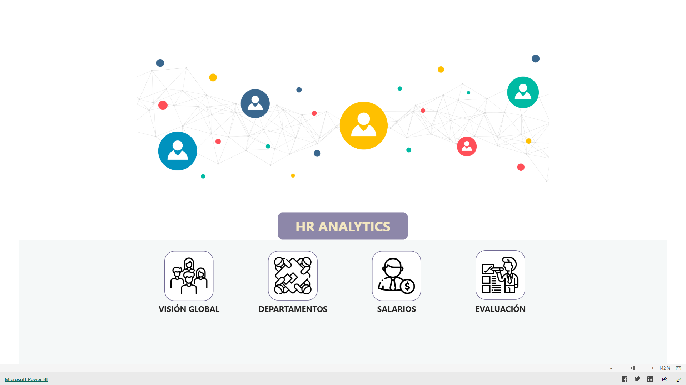
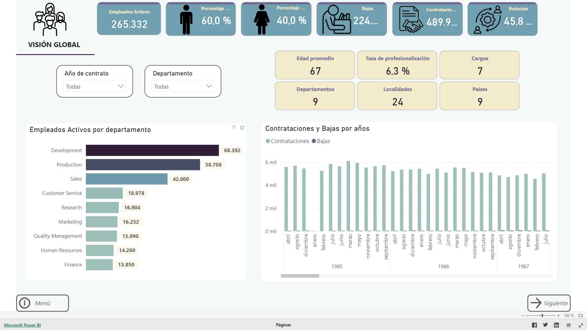
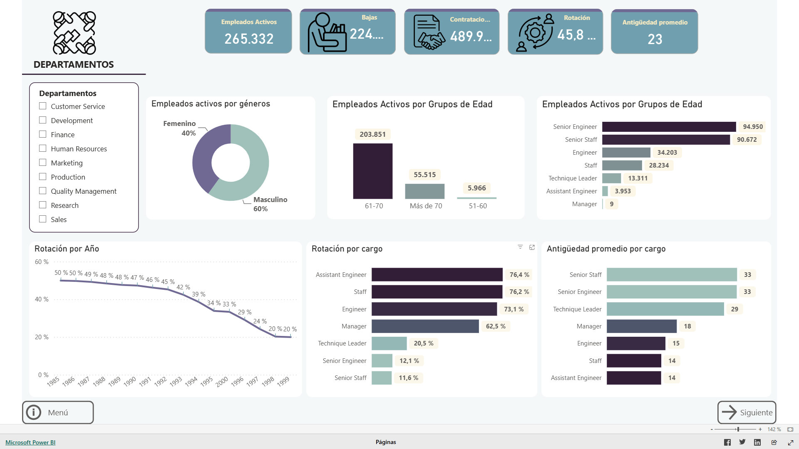
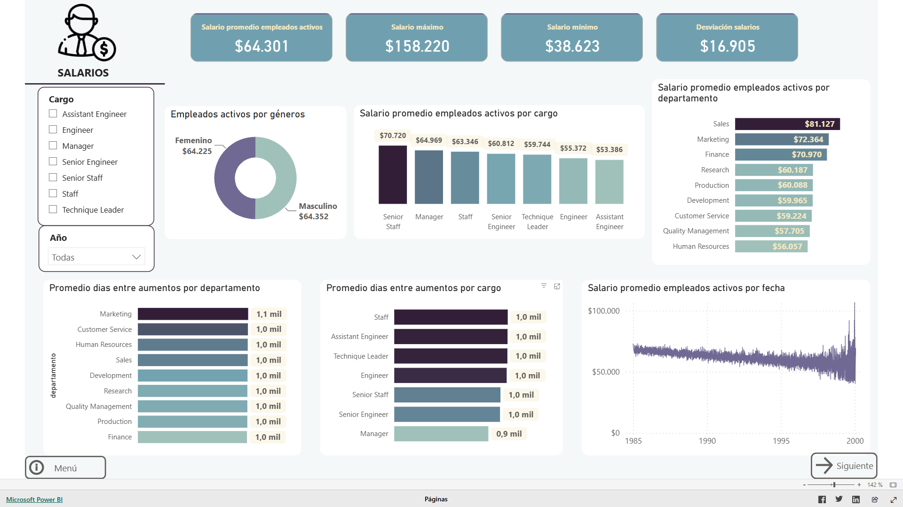
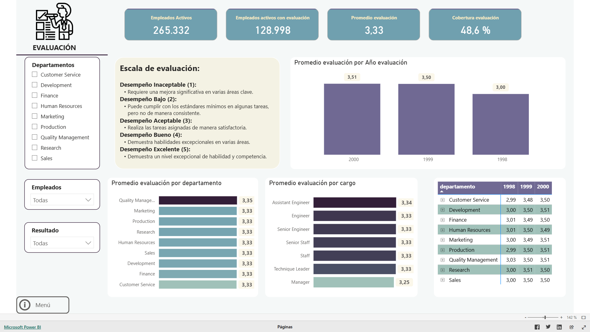

# 📊 People Analytics — Análisis de Recursos Humanos con MySQL y Power BI


> Pipeline de analítica de personas **end-to-end**: desde la exploración de datos en
> MySQL hasta un dashboard interactivo en Power BI con insights accionables sobre la
> plantilla (rotación, antigüedad, salarios y desempeño).

🔗 **[▶️ Ver Dashboard interactivo en Power BI](https://app.powerbi.com/view?r=eyJrIjoiOWNlODJiY2EtZDY2MC00MmUwLTk5ZWYtMjM5OWQ0ZTZlYWE3IiwidCI6ImYzNmUxNTJkLWE4OTctNDY4NC04ZDYzLWYxN2UxODFlODE2NyJ9)**



---

## 📋 Descripción

Caso práctico de análisis de la **Employee Sample Database** de MySQL, que simula el
entorno de RR. HH. de una organización (empleados, salarios, títulos, departamentos y
fechas de contratación). El objetivo es construir un cuadro de mando que permita a
dirección y RR. HH. tomar decisiones basadas en datos sobre la plantilla.

- **Fuente:** [Employee Sample Database — MySQL](https://dev.mysql.com/doc/employee/en/)
- **Volumen:** 265.332 empleados activos · 9 departamentos · 9 países · 24 localidades

## 🎯 Objetivo

Obtener una visión 360º de la plantilla en cuatro ejes —**visión global, departamentos,
salarios y evaluación**— que responda a preguntas de negocio como: ¿cuánta rotación
tenemos y dónde?, ¿está envejeciendo la plantilla?, ¿cómo se distribuyen los salarios y
los aumentos?, ¿qué cobertura y nivel de desempeño tenemos?

## 🛠️ Stack y proceso

| Etapa | Herramienta | Detalle |
|---|---|---|
| Exploración y extracción | **MySQL** | Análisis de tablas y *query* de empleados enriquecida ([`sql/`](sql/)) |
| Transformación | **Power Query** | Limpieza, tipos, tratamiento de `9999-01-01`, columnas calculadas ([`powerbi/modelo_datos.md`](powerbi/modelo_datos.md)) |
| Modelado y métricas | **DAX** | Rotación, antigüedad, profesionalización, bajas, tabla calendario ([`powerbi/medidas_dax.md`](powerbi/medidas_dax.md)) |
| Visualización | **Power BI** | Dashboard interactivo de 4 secciones |

## 📊 Modelo de datos


---

## 📈 El dashboard

### 1 · Visión global

KPIs de plantilla, distribución por género y departamento, evolución de contrataciones
y bajas, rotación, antigüedad y profesionalización.

### 2 · Departamentos

Plantilla por departamento, grupos de edad y cargo; rotación por año y por cargo;
antigüedad promedio.

### 3 · Salarios

Salario promedio por cargo y departamento, frecuencia de aumentos salariales y evolución
salarial en el tiempo.

### 4 · Evaluación

Cobertura de evaluaciones, desempeño promedio por departamento, cargo y año, sobre una
escala de 1 a 5.

---

## 💡 Principales hallazgos

- **Plantilla activa:** 265.332 empleados (60% hombres · 40% mujeres).
- **Rotación histórica:** 45,8%, reducida progresivamente hasta estabilizarse en ~20% en
  los años recientes.
- **Antigüedad media:** 23 años → implicaciones en planificación de jubilaciones y
  renovación de talento.
- **Cargos más comunes:** Senior Engineer y Senior Staff — equipo altamente especializado.
- **Mayor rotación:** Assistant Engineer y Staff (>76%) — menor retención en niveles iniciales.
- **Frecuencia de aumentos salariales:** Manager cada ~2,3 años; perfiles Senior ~975 días;
  Staff / Assistant Engineer ~1.046 días.
- **Cobertura de evaluaciones:** solo el 48,6% de los empleados activos tiene evaluación
  registrada → punto de mejora para RR. HH.
- **Desempeño promedio:** 3,33 / 5 (entre "Aceptable" y "Bueno"), con tendencia de mejora
  consistente en todos los departamentos.

> 📌 **Informe ejecutivo:** versión resumida estilo consultoría disponible en
> [`informe-ejecutivo/`](informe-ejecutivo/) *(en preparación)*.

---

## 📁 Estructura del repositorio

```
people-hr-analytics/
├── README.md
├── img/                       # Capturas del dashboard y modelo de datos
├── sql/                       # Consulta de extracción + guía de carga
│   ├── 01_query_empleados.sql
│   └── README.md
├── powerbi/                   # Dashboard y documentación técnica
│   ├── HR_Analytics.pbix
│   ├── modelo_datos.md        # Transformaciones de Power Query
│   └── medidas_dax.md         # Medidas DAX
├── iconos/                    # Iconografía usada en el dashboard
└── informe-ejecutivo/         # Informe ejecutivo (HTML)
```

## ▶️ Cómo reproducirlo

1. Descarga la [Employee Sample Database](https://dev.mysql.com/doc/employee/en/) y
   cárgala en una instancia de MySQL.
2. Ejecuta [`sql/01_query_empleados.sql`](sql/01_query_empleados.sql).
3. Abre [`powerbi/HR_Analytics.pbix`](powerbi/HR_Analytics.pbix) en Power BI Desktop y
   actualiza el origen de datos apuntando a tu MySQL.

---

## 🧰 Habilidades demostradas

`SQL` · `Modelado de datos` · `Power Query (ETL)` · `DAX` · `Diseño de dashboards` ·
`Storytelling con datos` · `People / HR Analytics`
