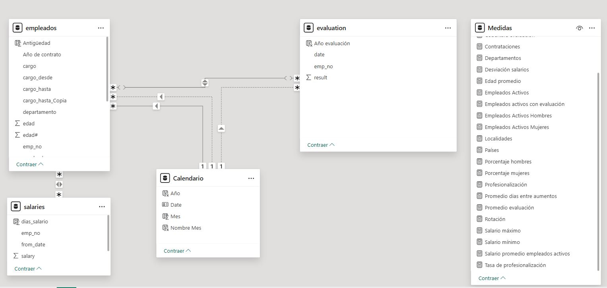

# 🔧 Modelado y transformación de datos (Power Query)

Resumen de las transformaciones aplicadas sobre la tabla de empleados importada
desde MySQL, antes de pasar al modelo de Power BI.



## 1. Tipos de datos y fechas
- Conversión de `fecha_contrato`, `fecha_nacimiento`, `cargo_desde` y `cargo_hasta`
  de *fecha/hora* a *fecha*.

## 2. Tratamiento del valor `1/1/9999`
En la columna `cargo_hasta` se repite la fecha `01/01/9999`, que indica que el
empleado **sigue ocupando** ese cargo (registro vigente).

- Se crea una columna condicional **`estado_cargo`**:
  - `cargo_hasta = 01/01/9999` → **"alta"** (empleado activo en el cargo)
  - cualquier otra fecha → **"baja"**
- Se duplica `cargo_hasta` y se reemplaza `01/01/9999` por *null* para poder calcular
  la fecha real de baja.
- El mismo criterio se aplica a la columna `to_date` de la tabla **salarios** (el valor
  `01/01/9999` corresponde al salario actual).

## 3. Edad y antigüedad
- Columna con la fecha actual para derivar la **edad** de cada trabajador.

## 4. Grado académico
- Muchos empleados no tienen titulación: los vacíos / `0` se sustituyen por **"Basic"**.
- Clasificación numérica para medir la **profesionalización** de la empresa:

  | Grado | Valor |
  |---|---|
  | Basic | 1 |
  | High school | 2 |
  | Middle school | 3 |
  | University | 4 |
  | Master | 5 |
  | PhD | 6 |

## 5. Grupos de edad (columna calculada DAX)
```dax
Grupo_edad = SWITCH(TRUE(),
    empleados[edad#] <= 30, "30 o menos",
    empleados[edad#] <= 40, "31-40",
    empleados[edad#] <= 50, "41-50",
    empleados[edad#] <= 60, "51-60",
    empleados[edad#] <= 70, "61-70",
    empleados[edad#] >  70, "Más de 70"
)
```

## 6. Tabla calendario
```dax
Calendario =
    CALENDAR(
        DATE(YEAR(MIN(empleados[fecha_contrato])), 1, 1),
        DATE(YEAR(MAX(empleados[cargo_hasta])), 12, 31)
    )
-- DATE() asegura el año completo en el valor máximo
```
Se usa una **relación inactiva** entre `Calendario[Date]` y `empleados[cargo_hasta]`
para poder medir las bajas por fecha (ver `Bajas` en [`medidas_dax.md`](medidas_dax.md)).
